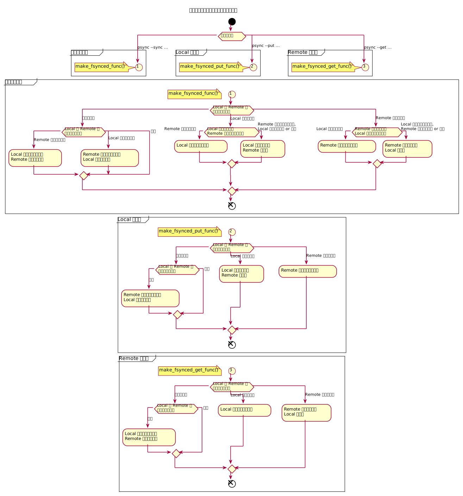

[技術資料](#技術資料) [ [配布ファイル](#配布ファイル) | [通信プロトコル](#通信プロトコル) | [設定ファイル構文](#設定ファイル構文) | [ファイルの同期方向決定アルゴリズム](#ファイルの同期方向決定アルゴリズム) | [進捗状況出力フォーマット](#進捗状況出力フォーマット) | [ファイル同期関数の使い方](#ファイル同期関数の使い方) ] / [README](../README_ja.md)

---

# 技術資料

## 配布ファイル
| ファイル名 | 内容
| -- | --
| [README.txt](../src/README.txt) | インストール手順と簡単な使い方説明
| [psync.h](../src/psync.h)<br>[psync.c](../src/psync.c) | [ファイル同期](#ファイル同期関数の使い方)([同期方向決定](#ファイルの同期方向決定アルゴリズム))
| [psync_psp.h](../src/psync_psp.h)<br>[psync_psp.c](../src/psync_psp.c) | [通信プロトコル](#通信プロトコル), ファイル同期起動
| [main.c](../src/main.c) | [設定ファイル解析](#設定ファイル構文), 引数解析, 通信プロトコル起動
| [popen3.h](../src/popen3.h)<br>[popen3.c](../src/popen3.c) | プロセス起動, プロセス間通信
| [progress.h](../src/progress.h)<br>[progress.c](../src/progress.c) | [進捗通知](#進捗状況出力フォーマット)
| [info.h](../src/info.h)<br>[info.c](../src/info.c) | [進捗表示](#進捗状況出力フォーマット)
| [tpbar.h](../src/tpbar.h)<br>[tpbar.c](../src/tpbar.c) | プログレスバー表示
| [common.h](../src/common.h)<br>[common.c](../src/common.c) | エラー判定/分岐, 中断判定/分岐, 数値データ[デ]シリアライザ, リスト処理
| ja/ | 日本語manマニュアル
| &emsp;[psync.1.in](../src/ja/psync.1.in) | &emsp;psync.1 の生成元
| &emsp;[psync.conf.5.in](../src/ja/psync.conf.5.in) | &emsp;psync.conf.5 の生成元
| [Makefile.in](../src/Makefile.in) | Makefile の生成元
| [configure.ac](../src/configure.ac) | config.h.in と configure, conf/ の生成元
| config.h.in<br>configure<br>conf/ | autoreconf -i 実行で configure.ac から自動生成される

## 通信プロトコル


## 設定ファイル構文


## ファイルの同期方向決定アルゴリズム


## 進捗状況出力フォーマット


## ファイル同期関数の使い方
- 使い方は簡単。 同期元と相手のディレクトリに対してそれぞれ psync_new(), psync_run(), psync_free() を順番に呼び出すだけ。
- 下記はカレントディレクトリの dir1/ と dir2/ 内のファイルを同期するサンプルコード。 説明用に エラー処理、中断処理、進捗表示 を省いている。
- psync_run() 呼び出し前に同期元の fdout を相手の fdin に、相手の fdout を元の fdin にそれぞれファイルディスクリプタで繋ぐ。 psync コマンドは SSH の標準入出力で繋いでいるが手段は何でも良い。 この例ではパイプで繋いでいる。
- psync_run() は同期元と相手の間でファイルデータ受け渡しの為に並列実行が必要。 psync コマンドでは別PC動作で並列実行しているが手段は何でも良い。 この例では pthread を使っている。
```c
/* psync_example.c - ファイル同期関数の使い方サンプルコード
 */

#include <pthread.h>  /* pthread_create() pthread_join() */
#include <unistd.h>   /* pipe() close() */
#include "psync.h"    /* psync_new() psync_run() psync_free() */

typedef struct {
    PSYNC *psync;
    pthread_t tid;
} PARAM;

static void *run_thread(void *data)
{
    PARAM *param = data;

    psync_run(param->psync);
    return NULL;
}

int main(int argc, char *argv[])
{
    PARAM param1;
    PARAM param2;
    int pipe1[2];
    int pipe2[2];

    pipe(pipe1);
    pipe(pipe2);
    param1.psync = psync_new("dir1", NULL);
    param1.psync->fdin = pipe1[0];
    param1.psync->fdout = pipe2[1];
    param2.psync = psync_new("dir2", NULL);
    param2.psync->fdin = pipe2[0];
    param2.psync->fdout = pipe1[1];
    pthread_create(&param1.tid, NULL, run_thread, &param1);
    pthread_create(&param2.tid, NULL, run_thread, &param2);
    pthread_join(param1.tid, NULL);
    pthread_join(param2.tid, NULL);
    psync_free(param1.psync);
    psync_free(param2.psync);
    close(pipe1[0]);
    close(pipe1[1]);
    close(pipe2[0]);
    close(pipe2[1]);
    return 0;
}
```
上記サンプルコードと pSync 配布ファイルの psync.c, psync.h, common.c, common.h, progress.c, progress.h を pthread を有効にして ビルド & リンク する。
GCC だとバージョンにもよるけど下記で良いと思う。
```sh
gcc -pthread -o psync_example psync_example.c psync.c common.c progress.c

```

下記はファイル同期の実行例。
- 実行の結果 dir1/ と dir2/ の内容が同期されて同じになる。
```sh
$ mkdir dir1 dir2
$ echo foo > dir1/file1
$ echo bar > dir1/file2
$ echo baz > dir2/file3
$ echo qux > dir2/file4
$ ls dir1 dir2
dir1:
file1   file2

dir2:
file3   file4
$ ./psync_example
$ ls dir1 dir2
dir1:
file1   file2   file3   file4

dir2:
file1   file2   file3   file4
$ cat dir1/file*
foo
bar
baz
qux
$ cat dir2/file*
foo
bar
baz
qux
$ echo quux > dir1/file5
$ echo FOO > dir2/file1
$ ls dir1 dir2
dir1:
file1   file2   file3   file4   file5

dir2:
file1   file2   file3   file4
$ cat dir1/file*
foo
bar
baz
qux
quux
$ cat dir2/file*
FOO
bar
baz
qux
$ ./psync_example
$ ls dir1 dir2
dir1:
file1   file2   file3   file4   file5

dir2:
file1   file2   file3   file4   file5
$ cat dir1/file*
FOO
bar
baz
qux
quux
$ cat dir2/file*
FOO
bar
baz
qux
quux
$
```
