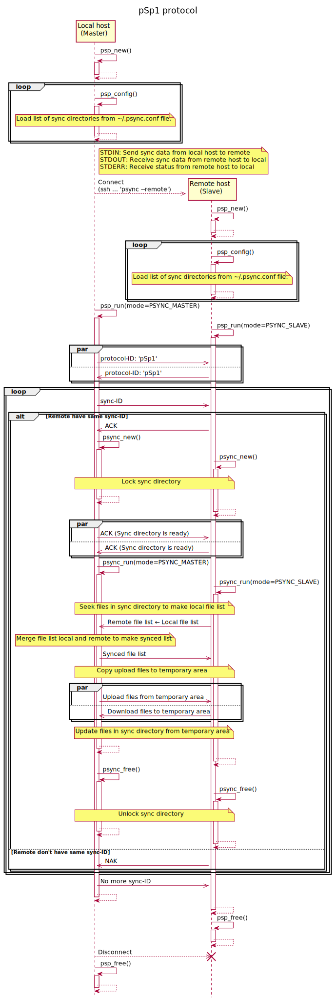

[技術資料](#技術資料)
[
[通信プロトコル](#通信プロトコル)
]
*|*
[README](../README_ja.md)

***

# 技術資料

## 配布ファイル
|ファイル名|内容|
---|---
|README.txt|インストール手順と簡単な使い方説明|
|psync.{c,h}|ファイル同期|
|psync_psp1.{c,h}|通信プロトコル, ファイル同期起動|
|main.c|設定ファイル解析, 引数解析, 通信プロトコル起動|
|popen3.{c,h}|プロセス起動, プロセス間通信|
|progress.{c,h}|進捗通知|
|info.{c,h}|進捗表示|
|common.{c,h}|エラー判定/分岐, 中断判定/分岐, 数値データ[デ]シリアライザ, リスト処理|
|ja/|日本語manマニュアル|
|　psync.1.in|　psync.1 の生成元|
|　psync.conf.5.in|　psync.conf.5 の生成元|
|Makefile.in|Makefile の生成元|
|configure.ac|config.h.in と configure, conf/ の生成元|
|config.h.in|autoreconf -i 実行で configure.ac から自動生成される|
|configure|(同上)|
|conf/|(同上)|

## 通信プロトコル

